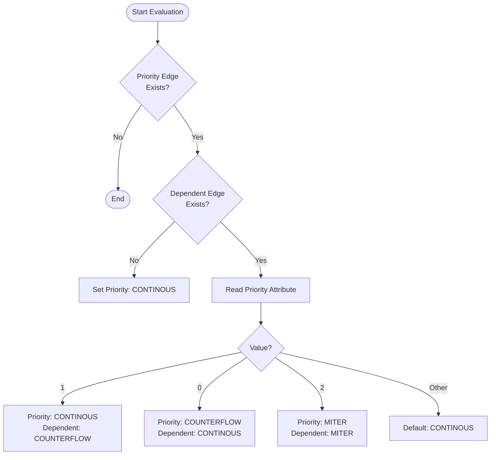
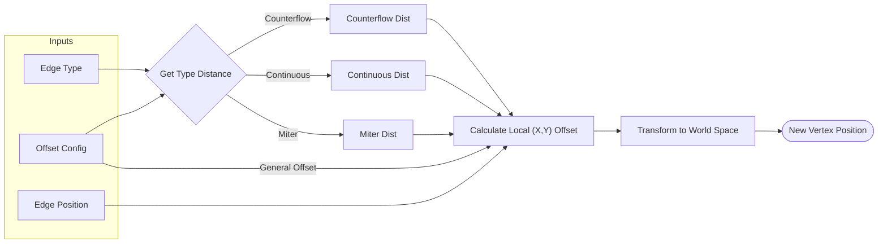
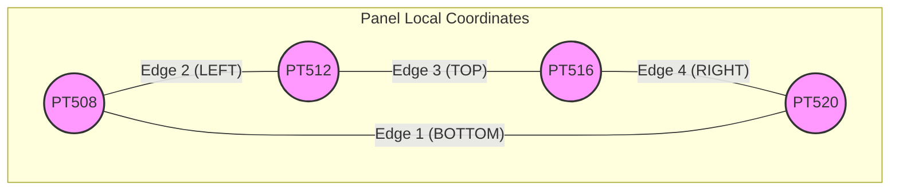
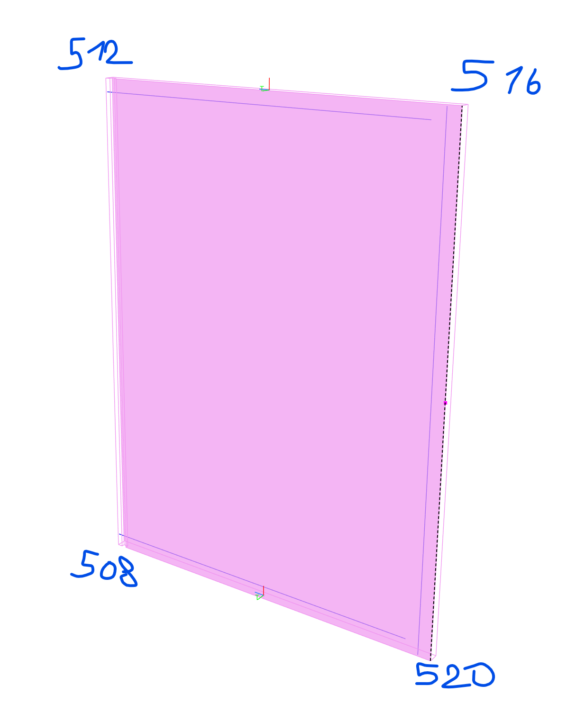

# Edge Profile & Offset Logic

This document explains the logic behind edge type determination and geometry offset calculations within the `BorderLine::EdgeProfile` module.

## 1. Edge Priority Logic

The `EdgeProfileLogic` class determines the type of edge (Continuous, Counterflow, or Miter) applied to the corners of a cabinet element. This decision is based on priority rules defined between adjacent edges.

### Priority Values
The relationship between two meeting edges is controlled by a user attribute (Priority Value):

|    Value    | Priority Edge Type | Dependent Edge Type | Description                                                        |
|:-----------:|:-------------------|:--------------------|:-------------------------------------------------------------------|
|    **1**    | `CONTINOUS`        | `COUNTERFLOW`       | Priority edge runs through; dependent edge stops short.            |
|    **0**    | `COUNTERFLOW`      | `CONTINOUS`         | Priority edge stops short; dependent edge runs through.            |
|    **2**    | `MITER`            | `MITER`             | Both edges meet at a 45-degree angle (equal offset).               |
| **Default** | `CONTINOUS`        | `CONTINOUS`         | Fallback state (usually implies overlapping or simple butt joint). |

### Decision Flow
The logic checks if the "Priority Edge" exists. If it does, it evaluates the "Dependent Edge" and the configured priority attribute.

## 2. Offset Strategy

The `StandardEdgeOffsetStrategy` calculates the physical 3D displacement of edge vertices based on the determined `EEdgeType` and the `EdgeOffsetConfig`.

### Configuration Parameters
*   **General Offset**: A base offset applied to the edge (e.g., edge thickness).
*   **Edge Type Offset**: Additional distance based on the specific edge type (Counterflow, Continuous, Miter).

### Calculation Process
For every vertex of an edge, a local (x, y) offset is calculated relative to the element's coordinate frame.

1.  **Determine Offsets**:
    *   `GeneralOffset` is retrieved from config.
    *   `EdgeTypeOffset` is retrieved based on `EEdgeType`.
2.  **Calculate Local Vector**:
    *   Specific formulas are applied based on the `EEdgePosition` (Bottom, Top, Left, Right) and the specific vertex ID (e.g., PT520, PT508).
3.  **Transform**:
    *   The local offset vector is added to the vertex's local position.
    *   The result is transformed back to World Coordinates.

### Corner Topology
The logic handles the 4 corners of the panel defined by vertices PT520, PT508, PT512, and PT516.

